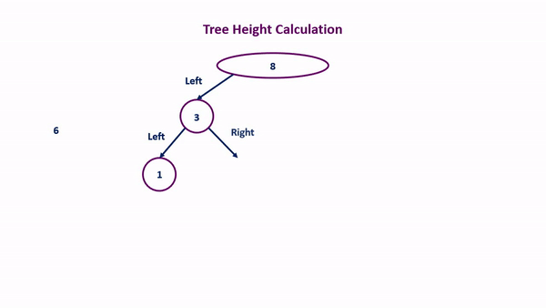
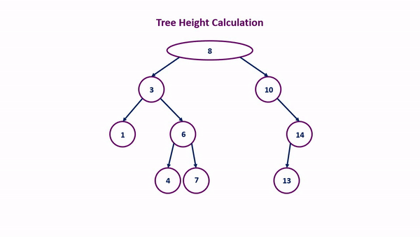

# TreeHeight
Assignment from the course "Advanced Algorithms" - Finding the height of a tree

## Binary tree

A binary tree is a data structure built of nodes in which each node holds the data along with the reference to the child pointers. Every node of a binary tree has at most two children, which are referred as left child and right child. The root is the topmost node of the binary tree.

## Binary search tree

A binary search tree (BST) is an ordered or sorted binary tree which stores data such as numbers in an organized way. 
Binary search tree properties:
* The left subtree of a node contains only nodes with values lesser than the node’s value.
* The right subtree of a node contains only nodes with values greater than the node’s value.
* The left and right subtree each must also be a binary search tree.

We insert the elements on the tree based on this assumption as follows:

### Tree height

The height of a tree is the length of the longest path that starts at the root node and ends at the leaf node, which is also called the maximum depth of a binary tree. Considering this definition the simplest algorithm that can be used to calculate that is similar to depth first search.
The process includes 3 steps:
1. Calculating the height of the left tree
2. Calculating the height of the tight tree
3. Calculating the largest height

All this work can be done using recursion since we have to visit every subtree and do the height calculations for each of them.

Graphically this algorithm is illustrated below:

